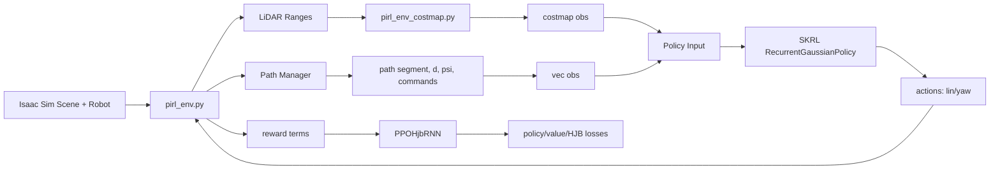

# PIRL Architecture & Deployment Guide

**PIRL** trains a recurrent neural network (RNN) policy for local obstacle avoidance and path-following in dynamic environments. This document covers the architecture, observation/action contracts, and deployment export process.

## High-Level Summary

`pirl` is an Isaac Lab / Isaac Sim reinforcement-learning project for local obstacle avoidance with a wheeled differential-drive robot in dynamic warehouse-like scenes. The project trains a SKRL PPO-RNN controller over LiDAR-derived local costmaps, path-following vector observations, and per-sector LiDAR hit positions, with an optional HJB-style critic regularizer that uses both the path-tracking error state and body-frame static-obstacle kinematics.

## Repository Map

- **[README.md](README.md)** — Quick start, installation, basic usage examples.
- **docs/** — Detailed design documentation:
  - [environment.md](docs/environment.md) — Task definitions, reward shaping, scene setup.
  - [DEPLOYMENT_OBSERVATION_SPACE.md](docs/DEPLOYMENT_OBSERVATION_SPACE.md) — ONNX actor schema (input/output shapes, normalization).
  - [pirl_path_contract_ros_like.md](docs/pirl_path_contract_ros_like.md) — Path manager interface for ROS2 controllers.
  - [HJB_THEORY_TIME_DISTANCE.md](docs/HJB_THEORY_TIME_DISTANCE.md) — Math and theory behind HJB auxiliary loss.
  - [ppo_aux_architecture_graph.md](docs/ppo_aux_architecture_graph.md) — Network diagrams (policy, value, recurrent state).
- **scripts/** — Training and inference entry points:
  - `train.py` — Launch PPO training runs.
  - `play.py` — Playback trained policies interactively.
  - `toOnnx.py` — Export policies to ONNX for deployment.
  - `check_observation_v2.py`, `random_agent.py`, `zero_agent.py` — Smoke tests.
- **source/pirl/pirl/tasks/direct/pirl/** — Core environment implementation:
  - `pirl_env.py` — Main task loop, LiDAR, rewards, dynamics.
  - `pirl_env_cfg.py` — Configurable parameters (robot, scene, episode length).
  - `pirl_env_costmap.py` — Multi-channel costmap rendering.
- **source/pirl/pirl/tasks/direct/pirl/agents/** — Policy and training:
  - `recurrent_models.py` — GRU policy and value networks.
  - `ppo_hjb_rnn.py` — SKRL trainer with HJB auxiliary loss.
  - `obs_layout.py` — Observation dict structure and flat-state ordering.
  - `skrl_ppo_aux_cfg.yaml` — SKRL training hyperparameters.
- **logs/** and **outputs/** — Generated training artifacts (checkpoints, event files, resolved configs).
- **pyproject.toml** — Repository-level configuration (linting, formatting, type checking with Pyright).

## Runtime Environment

Isaac Sim code runs inside the Isaac Lab Docker container (`isaac-lab-base`). From the `pirl/` directory (sibling to `IsaacLab/`):

**Start (host):**

```bash
PIRL_PROJECT_DIR=$(pwd) ../IsaacLab/docker/container.py start \
  --files $(pwd)/docker-compose.overlay.yaml
```

**Shell in (host):**

```bash
docker exec -it isaac-lab-base bash
cd /workspace/pirl
```

This mounts PIRL at `/workspace/pirl` and reuses the standard Isaac environment (X11, GPU, Omniverse cache).

### Training and Playback

Inside the container (`/workspace/pirl`):

```bash
python -m pip install -e source/pirl   # once per environment
python scripts/list_envs.py
python scripts/skrl/play.py --task=burger --agent=skrl_ppo_aux_cfg_entry_point --checkpoint=<PATH>
```

Long training jobs should only be launched explicitly:

```bash
python scripts/skrl/train.py --task=burger
```

**Training flags:** `--livestream 1`, `--num_envs 8` (default 8), `--max_iterations 1000` (default 10000). Logs land in `logs/skrl/<task>_direct/TIMESTAMP_ppo_aux_torch/`.

**ONNX export:**

```bash
python scripts/toOnnx.py --checkpoint=<CKPT_DIR> --output=policy.onnx
```

Requires **skrl 2.1+** (bundled with Isaac Lab; pinned again in `source/pirl/setup.py` when you `pip install -e source/pirl`).

### Container Philosophy

- **No hardcoded paths** in code; `docker-compose.overlay.yaml` provides portability.
- **Zero-copy development** — edits on host are live in container (no image rebuild).
- **AI workflows** should run inside the container. Host-side git, ruff, and pre-commit are preferred unless explicitly requested.

## Architecture Notes



Data flow summary:

1. `pirl_env.py` computes LiDAR ranges, local costmap, path projection, local path window, and geometric errors.
2. Observations are split into `vec` and `costmap` branches. SKRL flattens Dict observations in sorted key order,
   so the flat state order is `costmap` first, then `vec`.
3. `RunningStandardScaler` normalizes the flat state during training. Its `running_mean` and `running_variance`
   are saved in full SKRL checkpoints.
4. `RecurrentGaussianPolicy` outputs normalized linear/yaw actions and a recurrent hidden state. The environment
   maps normalized actions to differential-drive wheel velocity targets.
5. Rewards combine path progress, path error, heading alignment, proximity/collision, and optional reverse shaping.

Network diagrams: [docs/ppo_aux_architecture_graph.md](docs/ppo_aux_architecture_graph.md).

## Configuration

- **Task/scene/rewards:** `source/pirl/pirl/tasks/direct/pirl/pirl_env_cfg.py`
- **SKRL hyperparameters:** `source/pirl/pirl/tasks/direct/pirl/agents/skrl_ppo_aux_cfg.yaml`

## Deployment And ONNX

The physical ROS2 controller consumes exported ONNX policies, usually converted from SKRL `.pt` checkpoints with
`scripts/toOnnx.py`.

Current deployment-facing actor inputs (ObservationSchemaV2.1) are:

- `vec`: `[1, 68]` — ego (2) + tracking (2) + path window (24) + LiDAR sectors (32) + memory (8)  
  *(batch=1)*
- `costmap`: `[1, 6, 100, 100]`  
  *(batch=1, 6 channels, 100×100 grid)*
- `rnn_state`: `[1, 1, 256]`  
  *(batch=1, layers=1, hidden=256)*

Current outputs are:

- `mean`: `[1, 2]` normalized `[linear_velocity, yaw_velocity]`  
  *(batch=1)*
- `rnn_state_out`: `[1, 1, 256]`  
  *(batch=1, layers=1, hidden=256)*

When changing anything that affects policy inputs, policy architecture, recurrent state size, action scaling, or
state normalization, update `scripts/toOnnx.py` in the same change. This includes `vec` layout, costmap shape,
Dict flattening assumptions, `RunningStandardScaler` behavior, GRU size/layers, `aux_dim`, and `mean_head`.

Prefer ONNX exports that keep C++ integration simple: separate `vec`, `costmap`, and `rnn_state` inputs, with
SKRL flat ordering and state normalization embedded inside the ONNX wrapper. The ROS2 side should not need to
reimplement Python Dict flattening or scaler slicing.

## Development Principles

**Keep changes focused and minimal:**
- Scope edits to the behavior being changed; avoid broad refactors unless they reduce complexity.
- Do not add generic guardrails, fallbacks, or boilerplate. Prefer explicit invariants and simple failure modes.
- Add abstractions only when they remove real duplication or match an established local pattern.

**Treat coupled systems as explicit contracts:**
- Observation layout, action mapping, reward definitions, HJB/CBF math, and deployment export are tightly coupled.
- Changing one usually requires checking all others.
- When updating policy inputs, policy architecture, recurrent state size, action scaling, or state normalization, update `scripts/toOnnx.py` in the same change. This includes `vec` layout, costmap shape, Dict flattening, scaler behavior, GRU size/layers, and mean_head.

**Minimize maintenance overhead:**
- Do not modify generated checkpoints or event files in place.
- New exported artifacts are written only when explicitly requested.
- Avoid launching multiple long Isaac Sim jobs simultaneously.

**Prefer separation of concerns:**
- ONNX exports should embed state normalization and flat ordering; the ROS2 C++ side should not reimplement Python Dict flattening or scaler logic.

## Validation

Use checks that fit the change. Smoke tests are optional: run them when they provide useful signal for the files being changed, and skip them for documentation-only or clearly local edits.

- **Observation/export smoke:** `python scripts/check_observation_v2.py` or `python scripts/toOnnx.py --checkpoint=<CHECKPOINT.pt> --output=<POLICY.onnx>`.
- **Runtime smoke** (only when environment behavior changed): `python scripts/list_envs.py`, `scripts/zero_agent.py`, or `scripts/random_agent.py`.
- **Host-side checks:** `git`, `ruff`, and `pre-commit` should run on the host, not inside the container, unless explicitly requested.

## Troubleshooting

**Python not found in container** — use `docker exec -it isaac-lab-base bash`; inside the container `python` is Isaac Lab's interpreter (see `.bashrc` aliases).

**Container not running** — `docker ps -a`, then re-run `container.py start` from `pirl/`.

**Slow training / low GPU use** — check `nvidia-smi`, increase `--num_envs` if memory allows, try `--livestream 1` to rule out rendering bottlenecks.

**Observation shape mismatch at playback** — checkpoint must match current `obs_layout.py` and `skrl_ppo_aux_cfg.yaml`; run `python scripts/check_observation_v2.py`.

**Docker permission errors on logs** — `export DOCKER_UID=$(id -u) DOCKER_GID=$(id -g)` before `container.py start`, or set `UID`/`GID` in `docker-compose.overlay.yaml`.

## Key Files

- `source/pirl/pirl/tasks/direct/pirl/pirl_env.py`
- `source/pirl/pirl/tasks/direct/pirl/pirl_env_cfg.py`
- `source/pirl/pirl/tasks/direct/pirl/pirl_env_costmap.py`
- `source/pirl/pirl/tasks/direct/pirl/agents/recurrent_models.py`
- `source/pirl/pirl/tasks/direct/pirl/agents/ppo_hjb_rnn.py`
- `source/pirl/pirl/tasks/direct/pirl/agents/obs_layout.py`
- `source/pirl/pirl/tasks/direct/pirl/agents/skrl_ppo_aux_cfg.yaml`
- `scripts/toOnnx.py`
- `docs/DEPLOYMENT_OBSERVATION_SPACE.md`
- `docs/pirl_path_contract_ros_like.md`
- `docs/ppo_aux_architecture_graph.md`
- `docs/HJB_THEORY_TIME_DISTANCE.md`
