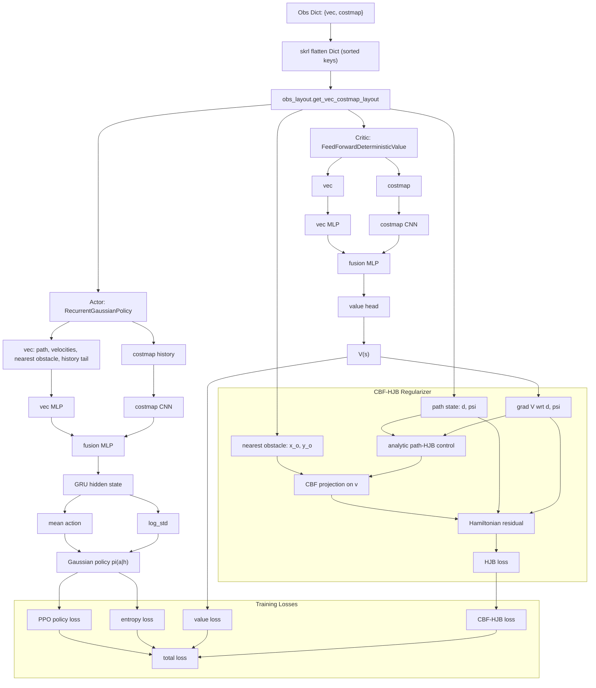

# PPO + CBF-HJB Architecture Graph

With `separate: True`, actor and critic have separate parameter sets. The CBF-HJB
branch regularizes the critic through `V(s)` and does not directly update the actor.
The actor is affected only indirectly through improved value targets/advantages during
PPO training.
