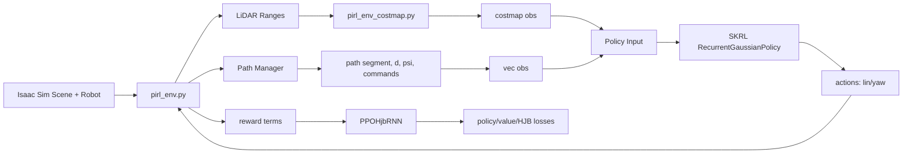

# Project Overview

`pirl` is an Isaac Lab/Isaac Sim reinforcement-learning project for local obstacle avoidance with
a tracked differential-drive robot in dynamic warehouse-like scenes. The repo provides a custom
direct RL environment (`pirl.tasks`) with LiDAR-driven local costmaps, path-following rewards, and
SKRL PPO-RNN training scripts, plus an optional HJB PINN-style critic regularizer.

## Repository Structure

- `README.md` - setup and usage instructions for Isaac Lab template workflow.
- `docs/` - project-specific design notes (path contract, POMDP/costmap notes, architecture graphs).
- `scripts/` - runnable entrypoints for training, playbackЭто, по моему мнению, более удачный кандидат для дипломной работы, и сейчас объясню почему — а также как корректно обойти ваш справедливый страх по поводу шума лидара.

, env listing, and dummy agents.
- `source/` - Python package source (`source/pirl`) and extension packaging files.
- `logs/` - training artifacts (TensorBoard/event logs, dumped params).
- `outputs/` - Hydra run outputs and resolved configs.
- `teleop_test.py` - local test utility script.
- `pyproject.toml` - repo-level lint/format/type-check configuration.

Key subfolders:

- `scripts/skrl/` - SKRL train/play entrypoints.
- `source/pirl/pirl/tasks/direct/pirl/` - main environment implementation and reward/path logic.
- `source/pirl/pirl/tasks/direct/pirl/agents/` - PPO agent extensions, model definitions, configs.
- `source/pirl/config/` - extension metadata (`extension.toml` etc.).

## Build & Development Commands

```bash
# Runtime note (isaac_lab_pinn container):
# Standard `python` is not used for project execution.
# Use Isaac Sim launcher wrapper:
ISAAC_PY="/isaac-sim/python.sh"

# Install the project package in editable mode
$ISAAC_PY -m pip install -e source/pirl
```

```bash
# List available environments/tasks
$ISAAC_PY scripts/list_envs.py
```

```bash
# Train with SKRL PPO (default task from script args)
$ISAAC_PY scripts/skrl/train.py --task=jettank
```

```bash
# Play/evaluate a checkpoint
$ISAAC_PY scripts/skrl/play.py --task=<TASK_NAME> --checkpoint=<PATH_TO_CHECKPOINT>
```

```bash
# Dummy-agent smoke tests
$ISAAC_PY scripts/zero_agent.py --task=<TASK_NAME>
$ISAAC_PY scripts/random_agent.py --task=<TASK_NAME>
```

```bash
# Formatting / linting / hooks
pre-commit run --all-files
ruff check .
ruff format .
```

```bash
# Type-check (if pyright is installed in your environment)
pyright
```

```bash
# Debugging notes
# Always run project scripts via Isaac Sim launcher wrapper inside isaac_lab_pinn:
# /isaac-sim/python.sh <script.py> [args...]
```

```bash
# Deploy / release
> TODO: Define release/publish workflow (wheel upload, extension registry, or container release).
```

## Code Style & Conventions

- Python style is enforced with `ruff` (line length `120`, target `py310`) from root
  `pyproject.toml`.
- Format with `ruff format`; lint with `ruff check` (auto-fix allowed where safe).
- Import ordering follows custom Isaac/Omniverse sections configured under `tool.ruff.lint.isort`.
- Type-checking baseline is `pyright` with `typeCheckingMode = "basic"`.
- Prefer clear, explicit names:
  - modules/files: `snake_case.py`
  - classes: `PascalCase`
  - functions/vars: `snake_case`
  - constants: `UPPER_SNAKE_CASE`
- Config naming:
  - env/task configs in `*_cfg.py` and YAML files in `agents/*_cfg.yaml`.
- Commit message template (recommended):
  - `<type>(<scope>): <short imperative summary>`
  - Example: `feat(path): add signed cross-track error to vec observation`
  - Common types: `feat`, `fix`, `refactor`, `docs`, `test`, `chore`.

## Architecture Notes



Data flow summary:

1. Environment step computes LiDAR, path projection, local path window, and geometric errors.
2. Observations are split into:
   - `vec` branch (alignment, velocities, `d`, `psi`, local path, previous action/reward components).
   - `costmap` branch (stacked local occupancy grids from LiDAR + inflation).
3. Actor outputs normalized actions; env maps them to differential-drive wheel velocity targets.
4. Rewards combine path progress, path error, heading alignment, proximity/collision, and optional
   reverse shaping.
5. Agent update uses PPO losses plus an optional HJB residual on the critic.

## Testing Strategy

- Current validation is primarily scenario/smoke-based (no dedicated `tests/` tree detected).
- Local checks:
  1. `/isaac-sim/python.sh scripts/list_envs.py` (task registration sanity).
  2. `/isaac-sim/python.sh scripts/zero_agent.py --task=<TASK_NAME>` (env stepping stability).
  3. `/isaac-sim/python.sh scripts/random_agent.py --task=<TASK_NAME>` (observation/action/reward pipeline).
  4. Short PPO run (`/isaac-sim/python.sh scripts/skrl/train.py`) and inspect logs in `logs/skrl/...`.
- Static checks:
  - `pre-commit run --all-files`
  - `ruff check .`
  - `pyright` (when available)
- CI:
  - `> TODO: Document CI matrix and required pass criteria once workflow files are added.`

## Security & Compliance

- Never commit secrets, private keys, tokens, or machine-local credentials.
- Pre-commit includes `detect-private-key` and large-file checks; keep hooks enabled.
- Treat `logs/` and `outputs/` as generated artifacts; do not include sensitive runtime dumps.
- Dependency surface:
  - package install defined in `source/pirl/setup.py` (`psutil` currently explicit).
  - `> TODO: Add dependency vulnerability scanning policy (e.g., pip-audit/Snyk/GHAS).`
- Licensing:
  - repository headers indicate BSD-3-Clause from Isaac Lab template lineage.
  - `> TODO: Add/verify top-level LICENSE file and third-party attribution section.`

## Agent Guardrails

- Do not edit generated run artifacts under `logs/` or `outputs/` unless explicitly requested.
- Do not modify checkpoints/event files in-place; write new outputs instead.
- Avoid broad refactors across unrelated modules in one change.
- Prefer minimal, scoped edits in:
  - `source/pirl/pirl/tasks/direct/pirl/*` for environment logic.
  - `source/pirl/pirl/tasks/direct/pirl/agents/*` for policy/loss logic.
- Require human review for:
  - reward-definition changes,
  - action/kinematics mapping,
  - HJB loss math changes,
  - config defaults that affect reproducibility.
- Run at least one smoke command (zero/random agent or short train) after substantial logic edits.
- Avoid launching multiple long Isaac Sim training jobs concurrently on the same machine.

## Extensibility Hooks

- Task/environment config hooks:
  - `source/pirl/pirl/tasks/direct/pirl/pirl_env_cfg.py`
- Agent/trainer config hooks:
  - `source/pirl/pirl/tasks/direct/pirl/agents/skrl_ppo_aux_cfg.yaml`
- Custom model/loss extension points:
  - `source/pirl/pirl/tasks/direct/pirl/agents/recurrent_models.py`
  - `source/pirl/pirl/tasks/direct/pirl/agents/ppo_hjb_rnn.py`
- Observation-layout mapping hook:
  - `source/pirl/pirl/tasks/direct/pirl/agents/obs_layout.py`
- Feature flags via config:
  - HJB loss (`hjb_loss_scale`)
  - reward term scales in env config
- Runtime/env vars:
  - `> TODO: Document required Isaac Sim / Isaac Lab environment variables per deployment setup.`

## Further Reading

- `README.md`
- `docs/pirl_path_contract_ros_like.md`
- `docs/pirl_direct_pomdp_costmap.md`
- `docs/ppo_aux_architecture_graph.md`
- `docs/HJB_THEORY_TIME_DISTANCE.md`
- `source/pirl/pirl/tasks/direct/pirl/pirl_env.py`
- `source/pirl/pirl/tasks/direct/pirl/pirl_env_cfg.py`
