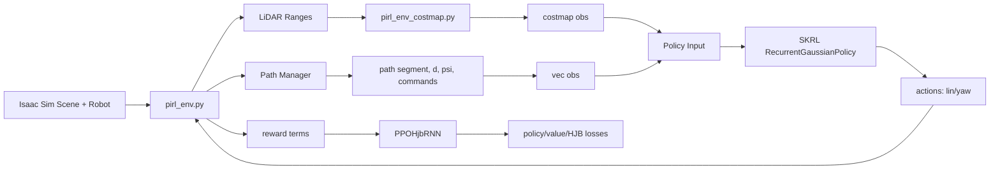

# Project Overview

`pirl` is an Isaac Lab / Isaac Sim reinforcement-learning project for local obstacle avoidance with
a tracked differential-drive robot in dynamic warehouse-like scenes. The project trains a SKRL
PPO-RNN controller over LiDAR-derived local costmaps, path-following vector observations, and
per-sector LiDAR hit positions, with an optional HJB-style critic regularizer that uses both the
path-tracking error state and body-frame static-obstacle kinematics.

## Repository Map

- `README.md` - setup and Isaac Lab template usage notes.
- `docs/` - project design notes, path contract, deployment observation notes, and architecture diagrams.
- `scripts/` - runnable entrypoints for training, playback, environment listing, dummy agents, and ONNX export.
- `source/pirl/` - Python package source and extension metadata.
- `source/pirl/pirl/tasks/direct/pirl/` - main direct environment, path logic, rewards, and costmap code.
- `source/pirl/pirl/tasks/direct/pirl/agents/` - custom PPO agent, recurrent models, observation layout, and configs.
- `logs/` and `outputs/` - generated training artifacts and resolved configs.
- `pyproject.toml` - repo-level lint, format, and pyright settings.

## Runtime Environment

Isaac Sim code normally runs inside the Isaac container. Standard `python` may not exist there; use:

```bash
ISAAC_PY="/isaac-sim/python.sh"
$ISAAC_PY scripts/list_envs.py
$ISAAC_PY scripts/skrl/play.py --task=<TASK_NAME> --checkpoint=<PATH_TO_CHECKPOINT>
```

Long training jobs should only be launched when explicitly needed:

```bash
$ISAAC_PY scripts/skrl/train.py --task=jettank
```

For remote visual debugging, training can use `--livestream 1` over WebRTC/Tailscale; on the simulation PC,
`--livestream 2` may be appropriate.

The AI agent usually runs inside the Isaac container. Do not run `git`, `ruff`, or `pre-commit` from this
environment unless the user explicitly asks for it; host-side ownership/tooling often makes those checks noisy.
Prefer Isaac Python checks only when they are useful for the change.

## Architecture Notes



Data flow summary:

1. `pirl_env.py` computes LiDAR ranges, local costmap, path projection, local path window, and geometric errors.
2. Observations are split into `vec` and `costmap` branches. SKRL flattens Dict observations in sorted key order,
   so the flat state order is `costmap` first, then `vec`.
3. `RunningStandardScaler` normalizes the flat state during training. Its `running_mean` and `running_variance`
   are saved in full SKRL checkpoints.
4. `RecurrentGaussianPolicy` outputs normalized linear/yaw actions and a recurrent hidden state. The environment
   maps normalized actions to differential-drive wheel velocity targets.
5. Rewards combine path progress, path error, heading alignment, proximity/collision, and optional reverse shaping.

## Deployment And ONNX

The physical ROS2 controller consumes exported ONNX policies, usually converted from SKRL `.pt` checkpoints with
`scripts/toOnnx.py`.

Current deployment-facing actor inputs (ObservationSchemaV2.1) are:

- `vec`: `[1, 68]` — ego (2) + tracking (2) + path window (24) + LiDAR sectors (32) + memory (8)
- `costmap`: `[1, 6, 100, 100]`
- `rnn_state`: `[1, 1, 256]`

Current outputs are:

- `mean`: `[1, 2]` normalized `[linear, yaw]` action
- `rnn_state_out`: `[1, 1, 256]`

When changing anything that affects policy inputs, policy architecture, recurrent state size, action scaling, or
state normalization, update `scripts/toOnnx.py` in the same change. This includes `vec` layout, costmap shape,
Dict flattening assumptions, `RunningStandardScaler` behavior, GRU size/layers, `aux_dim`, and `mean_head`.

Prefer ONNX exports that keep C++ integration simple: separate `vec`, `costmap`, and `rnn_state` inputs, with
SKRL flat ordering and state normalization embedded inside the ONNX wrapper. The ROS2 side should not need to
reimplement Python Dict flattening or scaler slicing.

## Development Principles

- Keep edits scoped to the behavior being changed. Avoid broad refactors unless they directly reduce current
  complexity.
- Do not add generic guardrail, fallback, or boilerplate code. Prefer explicit invariants and simple failure modes.
- Minimize maintenance overhead. Add abstractions only when they remove real duplication or match an established
  local pattern.
- Treat observation layout, action mapping, reward definitions, HJB/CBF math, and deployment export behavior as
  coupled contracts. Changing one usually requires checking the others.
- Do not modify generated checkpoints or event files in place. New exported artifacts may be written only when
  explicitly requested.
- Avoid launching multiple long Isaac Sim jobs at the same time.

## Validation

Use checks that fit the change. Smoke tests are optional: run them when they provide useful signal for the files
being changed, and skip them for documentation-only or clearly local edits.

- Observation/export smoke: `$ISAAC_PY scripts/check_observation_v2.py` or
  `$ISAAC_PY scripts/toOnnx.py --checkpoint=<CHECKPOINT.pt> --output=<POLICY.onnx>`.
- Runtime smoke, only when environment behavior changed: `$ISAAC_PY scripts/list_envs.py`,
  `scripts/zero_agent.py`, or `scripts/random_agent.py`.
- Avoid `git`, `ruff`, and `pre-commit` checks from inside the container unless explicitly requested.

## Key Files

- `source/pirl/pirl/tasks/direct/pirl/pirl_env.py`
- `source/pirl/pirl/tasks/direct/pirl/pirl_env_cfg.py`
- `source/pirl/pirl/tasks/direct/pirl/pirl_env_costmap.py`
- `source/pirl/pirl/tasks/direct/pirl/agents/recurrent_models.py`
- `source/pirl/pirl/tasks/direct/pirl/agents/ppo_hjb_rnn.py`
- `source/pirl/pirl/tasks/direct/pirl/agents/obs_layout.py`
- `source/pirl/pirl/tasks/direct/pirl/agents/skrl_ppo_aux_cfg.yaml`
- `scripts/toOnnx.py`
- `docs/DEPLOYMENT_OBSERVATION_SPACE.md`
- `docs/pirl_path_contract_ros_like.md`
- `docs/ppo_aux_architecture_graph.md`
- `docs/HJB_THEORY_TIME_DISTANCE.md`
