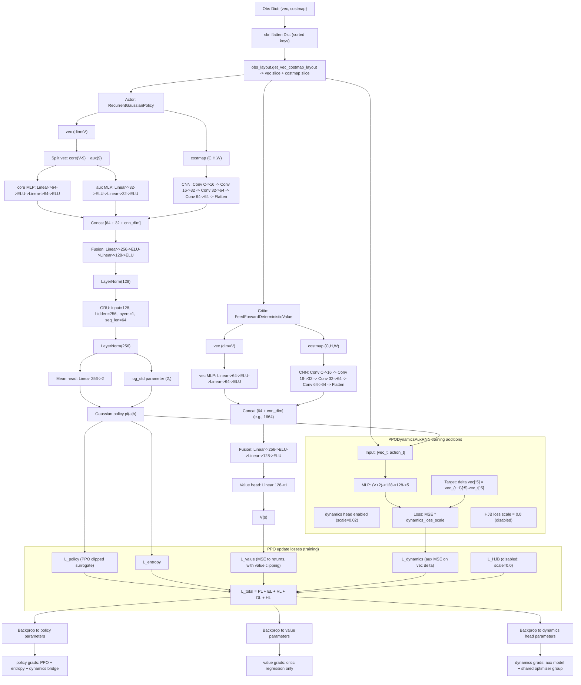

# PPO Aux Architecture Graph

## Mathematical note: `separate: True` and gradient flow

With `separate: True`, policy and value are different networks:

\[
\pi_\theta(a_t \mid h_t), \qquad V_\phi(s_t)
\]

where \(\theta\) are actor parameters and \(\phi\) are critic parameters.
In the current config, actor is recurrent (GRU) and critic is feed-forward.
So there is no shared actor-critic backbone in this setup.

### Total loss used in one PPO update

\[
\mathcal{L}_{\text{total}}
=
\mathcal{L}_{\pi}
 \mathcal{L}_{\text{ent}}
 \mathcal{L}_{V}
 \mathcal{L}_{\text{dyn}}
 \mathcal{L}_{\text{HJB}}
\]

Current config has \(\mathcal{L}_{\text{HJB}} = 0\).

### Parameter updates

\[
\theta \leftarrow \theta - \eta \nabla_\theta
\left(
\mathcal{L}_{\pi}
 \mathcal{L}_{\text{ent}}
 \mathcal{L}_{\text{dyn}}
\right)
\]

\[
\phi \leftarrow \phi - \eta \nabla_\phi \mathcal{L}_{V}
\]

Dynamics-head parameters \(\psi\):

\[
\psi \leftarrow \psi - \eta \nabla_\psi \mathcal{L}_{\text{dyn}}
\]

### Why dynamics loss can also update actor

In code, dynamics branch uses:

\[
a_{\text{dyn}}
=
a_{\text{sampled}}
\left(\mu_\theta - \text{stopgrad}(\mu_\theta)\right)
\]

Forward value is equal to \(a_{\text{sampled}}\), but gradient flows through \(\mu_\theta\).
Therefore, \(\mathcal{L}_{\text{dyn}}\) contributes to actor gradients.

### Simple toy example

Assume at one minibatch:

\[
\mathcal{L}_{\pi}=0.8,\quad
\mathcal{L}_{\text{ent}}=-0.02,\quad
\mathcal{L}_{V}=0.5,\quad
\mathcal{L}_{\text{dyn}}=0.1
\]

\[
\mathcal{L}_{\text{total}}=1.38
\]

But gradients are not "shared equally":

- actor receives gradients from \(\mathcal{L}_{\pi}, \mathcal{L}_{\text{ent}}, \mathcal{L}_{\text{dyn}}\),
- critic receives gradients from \(\mathcal{L}_{V}\) only,
- dynamics head receives gradients from \(\mathcal{L}_{\text{dyn}}\) only.

So `separate: True` means separate parameter sets and separate gradient paths, even though all losses are summed into one optimizer step.

### If backbone were truly shared

Shared actor-critic would look like:

\[
z_t = f_\omega(s_t),\quad
\pi_\theta(a_t\mid z_t),\quad
V_\phi(z_t)
\]

Then shared backbone parameters \(\omega\) would receive combined gradients from both policy and value losses.
That is not the case in the current configuration.

