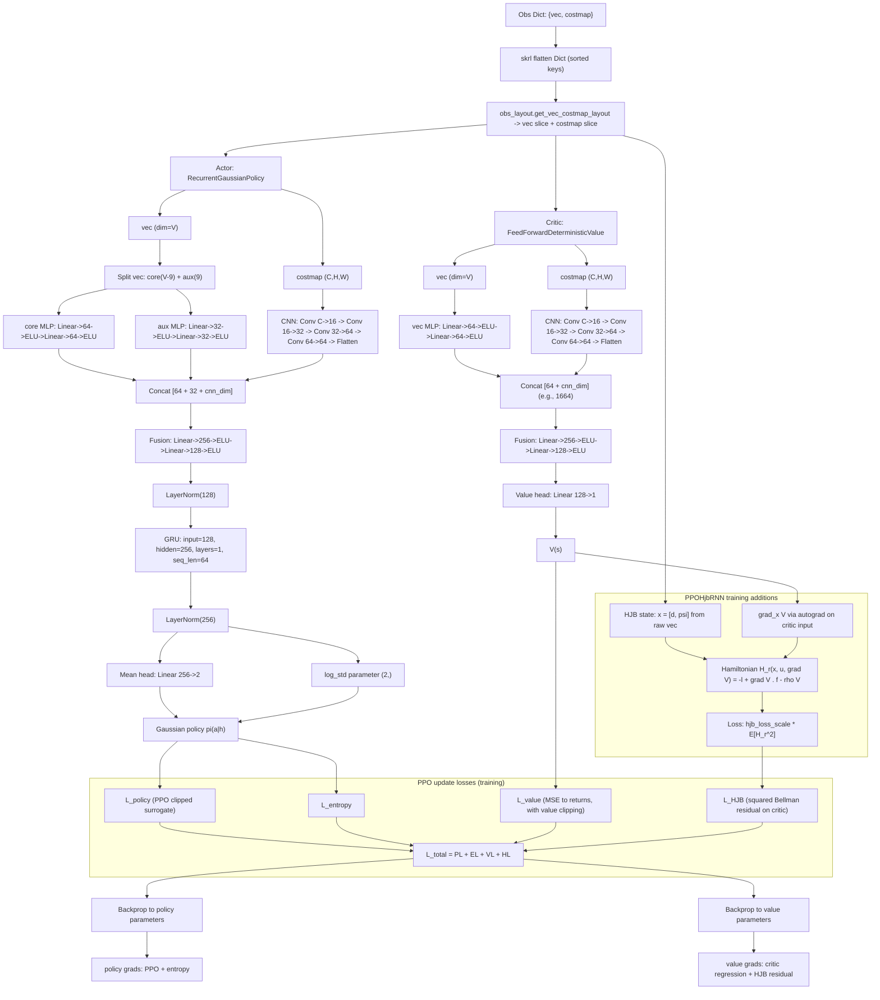

# PPO + HJB Architecture Graph

## Mathematical note: `separate: True` and gradient flow

With `separate: True`, policy and value are different networks:

\[
\pi_\theta(a_t \mid h_t), \qquad V_\phi(s_t)
\]

where \(\theta\) are actor parameters and \(\phi\) are critic parameters.
In the current config, actor is recurrent (GRU) and critic is feed-forward.
So there is no shared actor-critic backbone in this setup.

### Total loss used in one PPO update

\[
\mathcal{L}_{\text{total}}
=
\mathcal{L}_{\pi}
+ \mathcal{L}_{\text{ent}}
+ \mathcal{L}_{V}
+ \mathcal{L}_{\text{HJB}}
\]

If `hjb_loss_scale = 0`, the last term vanishes and the agent reduces to plain PPO-RNN.

### Parameter updates

Actor parameters \(\theta\) receive gradients from \(\mathcal L_\pi + \mathcal L_{\text{ent}}\):

\[
\theta \leftarrow \theta - \eta \nabla_\theta
\left(\mathcal{L}_{\pi} + \mathcal{L}_{\text{ent}}\right)
\]

Critic parameters \(\phi\) receive gradients from \(\mathcal L_V + \mathcal L_{\text{HJB}}\):

\[
\phi \leftarrow \phi - \eta \nabla_\phi
\left(\mathcal{L}_{V} + \mathcal{L}_{\text{HJB}}\right)
\]

So `separate: True` means separate parameter sets and separate gradient paths,
even though all losses are summed into one optimizer step.

### If backbone were truly shared

A shared actor-critic backbone would look like:

\[
z_t = f_\omega(s_t),\quad
\pi_\theta(a_t\mid z_t),\quad
V_\phi(z_t)
\]

Then shared backbone parameters \(\omega\) would receive combined gradients from both
policy and value losses (and from HJB through the critic head). That is not the case
in the current configuration.
